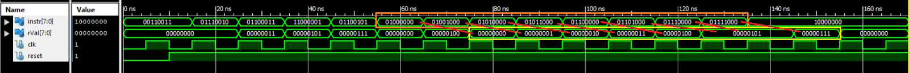

# CS F342 - Computer Architecture Assignment

## Problem Statement

### General description
```
This assignment consists of two parts, Part A and Part B:
```
```
A. Implement a Single Cycle processor in Verilog. This processor supports load immediate (li), constant addition (addi) and unconditional jump (J) instructions only. The processor has Reset and CLK as inputs and no outputs. The processor has instruction fetch unit, registerfile (with eight 8-bit registers), Execution and Writeback unit. Read operation on the registerfile is independent of CLK whereas the write happens on the positive edge of the CLK. When reset is activated the PC register is initialized to 0, the instruction memory and register file get loaded by predefined values. (Assume 8-bit PC. Also Assume Address and Data size as 8-bits). 
```
```
B. Implement 4-stage pipelined processor in Verilog. This processor supports load immediate (li), constant addition (addi) and Unconditional Jump (J) instructions only. The processor should implement forwarding to resolve data hazards. The processor has Reset, CLK as inputs and no outputs. The processor has instruction fetch unit, register file (with 8 8-bit registers), Execution and Writeback unit. Read and write operations on Register file can happen simultaneously and should be independent of CLK. The processor also contains three pipelined registers IF/ID, ID/EX and EX/WB. When reset is activated the PC, IF/ID, ID/EX, EX/WB registers are initialized to 0, the instruction memory and registerfile get loaded by predefined values. When the instruction unit starts fetching the first instruction the pipeline registers contain unknown values. When the second instruction is being fetched in IF unit, the IF/ID registers will hold the instruction code for first instruction. When the third instruction is being fetched by IF unit, the IF/ID register contains the instruction code of second instruction, ID/EX register contains information related to first instruction and so on. (Assume 8-bit PC. Also Assume Address and Data size as 8-bits). 
```
### Instructions and their format
```
The instructions and its 8-bit instruction format for single cycle and pipelined processor are shown below:
```
```
li DestinationReg, ImmediateData (Signextends data specified in instruction field (2:0) to 8-bits and stores it in register specified by register number in RDst field. Opcode for li is 00)

opCode[7:6] | rDest[5:3] | immediateData[2:0]
00|000-111|000-111
```
```
addi DestinationReg, immediateData   (adds data in register specified by register number in RDst field to sign extended data in immediate data field (2:0). Result is stored in register specified by register number in RDst field. Opcode for addi is 01)
opCode[7:6] | rDest[5:3] | immediateData[2:0]
01|000-111|000-111
```
```
j L1 (Jumps to an address generated by adding PC+1 to the Signextended data specified in instruction field (5:0). Opcode for j is 11)
opCode[7:6] | partialJumpAddress[5:0]
11|000000-111111
```
### Initial values for registers
```
On reset register file should get initialized such that R0 = 0, R1 = 1, R2 = 2, R3 = 3 …etc.
```
### Program
```
On reset assume that the instruction memory gets initialized with the following instructions: 
```
``` x86 assembly
    li Rx, 3
    addi Rx, 2
	addi Ry,3
	j L1
	li Rz, 4
L1:	addi Rz, -3
```
```
The value of x,y,z is unique for every student
In my case x = 6, y = z = 4;
```

## Proposed Design
### Single Cycle Processor

### Pipelined Processor


## Simulation Output
### Single Cycle Processor
- Raw

- Registers Marked

### Pipelined Processor
- Raw

- Registers Marked
